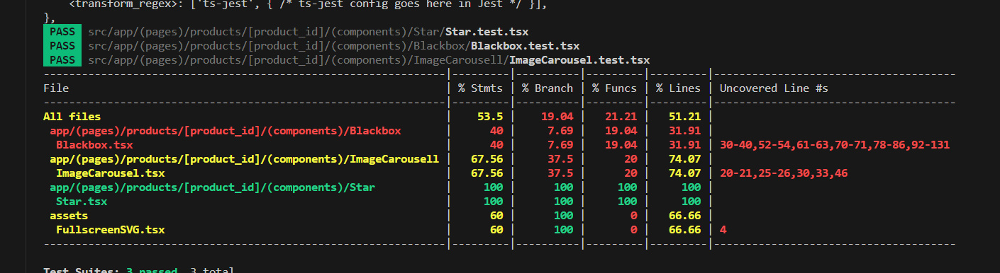
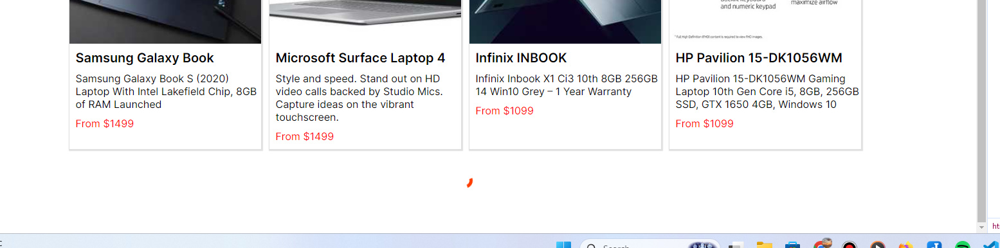
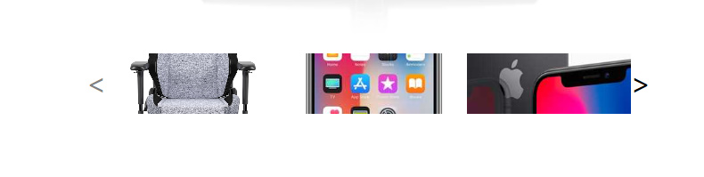
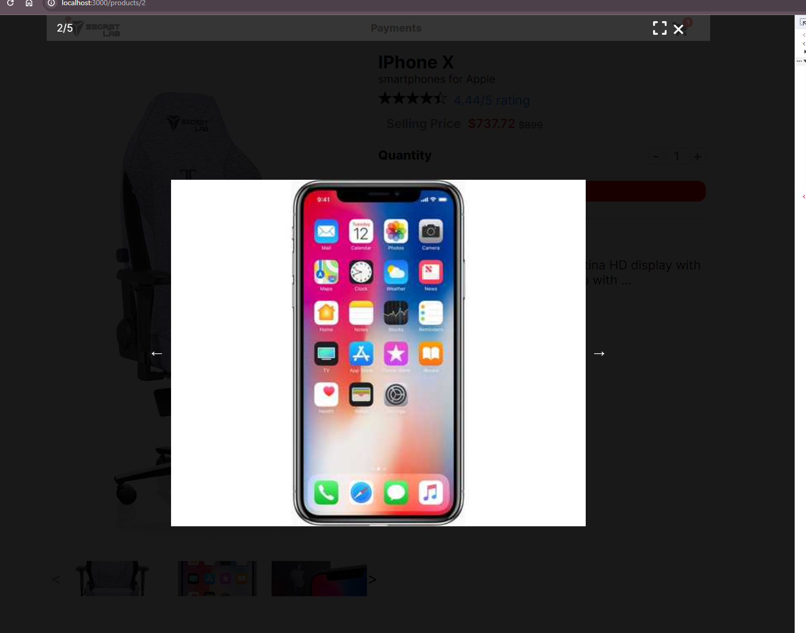

## Endpoints

- vercel: <a href="https://sctlb-vyredo.vercel.app/">`https://sctlb-vyredo.vercel.app/`</a>
- github: <a href="https://github.com/vyredo/sctlb">`https://github.com/vyredo/sctlb`</a>

## Note

Hey there! Task completed! 🎉

- The task are quite big especially since I have to create several component from scratch and create unittest for each file.
- I decide to keep design simple to save time.
- Focused on key features for ya! Let me know what you think. 😊
  - [x] Use Zustand for the state management (Zustand will throw warning if we update state that is not mounted)
  - [x] Integrate to a test payment gateway (Stripe payment)
  - [x] Unit test with report coverage, The test coverage can be improve in future
  - [x] try to follow all tech stack except tailwindcss, <a href="#why-css">reason why css</a>

## Tech Stack

- NextJS
- Scss <a href="#why-css">reason why css</a>

- Typescript
- State management library (Zustand)
- Animation library (CSS Animation) <a href="#why-css">reason why css</a>

- Payment (Stripe)
- Testing (React-Testing-library) -> requires extra libraries to preprocess tsx

## How to run locally

```bash
git clone
cd sctlb
npm run dev
```

## How to run test with coverage

```bash
npm run test
```



HTML coverage page can be view in
`<root>/jest-coverage/index.html`

## Custom React Component

- Infinite Loader
  

- Image Carousel
  

- Blackbox
  

## Animation

- turntable images
- star and rating bounces
- cart shake

<h4 id="why-css">Why CSS and not Tailwind for this task </h4>

- It's impossible to get familiar with all JS libraries and css preprocessor like: `stylex`, `tailwind`, `bootstrap`, `mui`, `less`, `postcss`
- I am most familiar with vanilla css with css animations
- I'm not really acquainted with tailwindcss, Although <strong>I am perfectly fine learning new tools</strong>, but to use unfamiliar tool within 7 days for the entire app seems a bit risky.
- So, I've opted for simple CSS. While Scss is mainly for generating those handy vendor prefix tags to handle browser compatibility vendor prefix.
